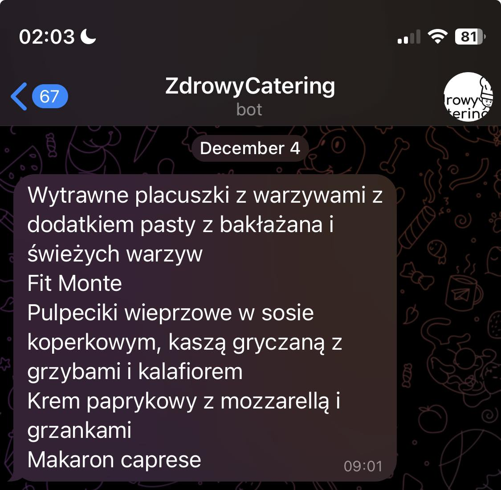

# Zdrowy Catering - Food Diet Notification
App hosted on new Azure service Containers Apps Job - check what I have in diet for today.  
  
  

https://www.zdrowycatering.pl/ delivers meals every day. You can order up to 5 meals. My girlfriend and I ordered two diets. We had to go on the website to see who got what. The application sends me a message every day at 8:00 a.m. telling me which dishes are mine.

# What have I learned?
- **Azure Container Apps** - It is new Azure resource. It became generally available in May 2022. https://azure.microsoft.com/en-us/updates/generally-available-azure-container-apps/
- **Azure Container Apps Jobs** - It is new Azure resource. It became generally available in August 2023. https://azure.microsoft.com/pl-pl/updates/generally-available-azure-container-apps-jobs/
- **How to fight with sidecars** - Selenium Standalone Browser is created as sidecar for scraper script
- **How to scrape website using Selenium** - First time scraping website
- **How Selenium is developed** - It is a BIG tool for testers and scrappers. It could be used to build whole enterprise testing environmnet with Selenium Grid.
- **How to contribute to Terraform AzureRM** - Because Azure Container Apps Jobs is new, it doesn't have terraform resources. I had to find it out. 
- What is and hot to use: liveness, rediness for containers
- Containerize application

# Deployment
## Infra
1. Infrastructure  
Most of the infra is described in Terraform. You can deploy it via `terraform apply -auto-approve -var-file="secrets.tfvars"`. File `secrets.tfvars` is not commited but is synced via Mega Cloud.
2. Container App Job   
Created via Azure CLI because terraform doesn't support it yet `az containerapp job create -n containerappjob-full3 -g zdrowycatering --yaml job-template.yaml`. 

## Code
Code is containerized in Docker.  
`docker build -t caishen/zdrowy_catering_notifications . && docker push caishen/zdrowy_catering_notifications`

# Know issues
1. Container App Job doens't have logs  
Logs from Log Analytics workspace are buggy. It is already repoted: https://github.com/microsoft/azure-container-apps/issues/1018
2. Container App Job can't be created via Terraform  
PR prepared: https://github.com/hashicorp/terraform-provider-azurerm/pull/23871#pullrequestreview-1758841710
3. Container App Job and Container Icons are not in Azur Acrhitectire icons  
    - https://github.com/microsoft/azure-container-apps/issues/1020
    - https://github.com/microsoft/azure-container-apps/issues/1021

# TODO
1. Prepare GitHub actions for whole deployment process
   1. Stage Application
      1. Docker Application
      2. Push Docker image
   2. Stage Infra
      1. Create Terraform Infra
      2. Create Container App Job
   3. Stage Documentation as code
      1. Drawio export as PNG
      2. List of Azure Resources   
      3. Ask ChatGPT to describe infra/application
2. Support semantic versioning
3. Support more than one user and one diet